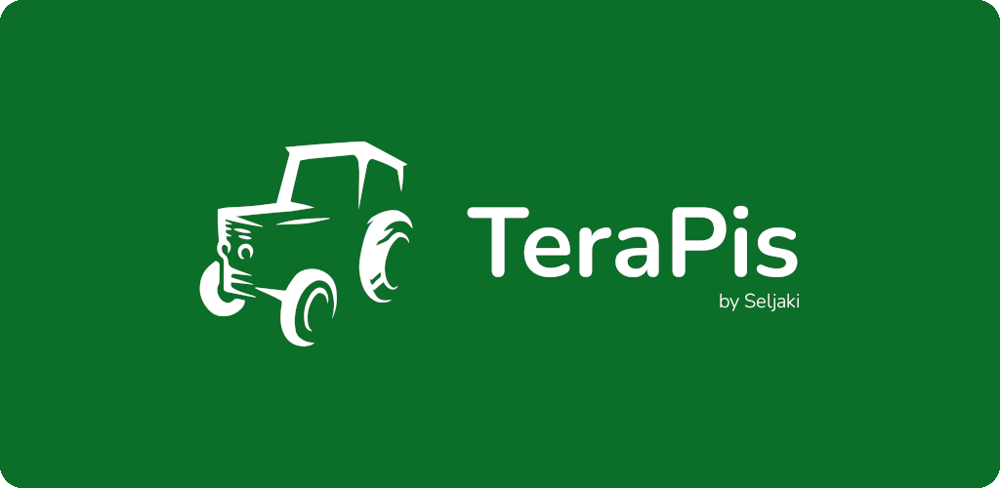
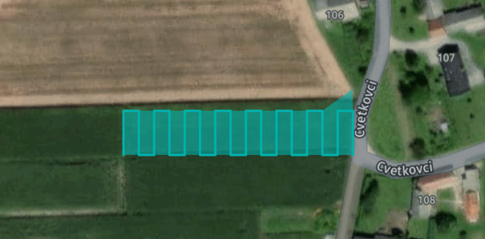

# About TeraPis

TeraPis is a language implemented in kotlin for showing fields and works on that field.
The output of the language is a GeoJSON file.

## Sample program

This program shows the most basic usage. It defines one plot and a type of work. It then calculates a path to
take through the field.

```kotlin
plot "Plot 1" {
  coordinates: [ 
    Point(16.0511,46.4113),
    Point(16.0513,46.4113),
    Point(16.0517,46.4114),
    Point(16.0523,46.4113),
    Point(16.0524,46.4114),
    Point(16.0527,46.4115),
    Point(16.0529,46.4115),
    Point(16.0531,46.4115),
    Point(16.0536,46.4115),
    Point(16.0538,46.4115),
    Point(16.0543,46.4117),
    Point(16.0543,46.4121),
    Point(16.0543,46.4122),
    Point(16.0543,46.4122),
    Point(16.0543,46.4123),
    Point(16.0543,46.4123),
    Point(16.0544,46.4123),
    Point(16.0544,46.4127),
    Point(16.0502,46.4128),
    Point(16.0503,46.4124),
    Point(16.0504,46.4121),
    Point(16.0505,46.4118),
    Point(16.0507,46.4114),
    Point(16.0508,46.4114),
    Point(16.0509,46.4113),
    Point(16.0511,46.4113)
  ],
  type: field
}

work "mowing" {
  action: "mowing",
  max-speed: 10,
  implement-width: 3
}

if plot "Plot 1" is valid {
  CalculatePath("Plot 1", "mowing")
}
```

| Sample json output     |
|------------------------|
|  |


## Prerequisites

To build and run this software you will need:
- Gradle version 8+
- Java version 18

## Configuring and running the app

1. Open the project in IntelliJ
2. Run ```./gradlew run input.piss output.json```

## Building the app

Run ```./gradlew build```

